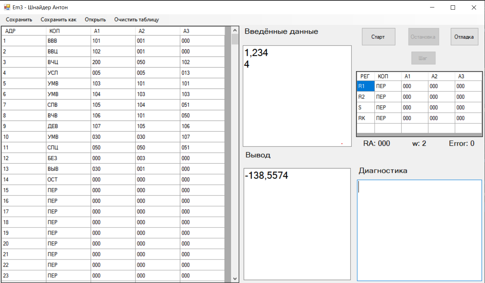

# em3_emulator
three-address computer emulator

You can do:
* arithmetic operations (+, -, \*, /)
* goto
* conditional goto depending on omega register (formed by arithmetic operations)
* copy from one register to another
* input number or array
* print number of array
* stop program

Program code can be saved or read from file.

You can run program in debug mode, evaluating each row manualy by "Step" button.
You also can see all registers, operands and next row.
  
### Main screen

